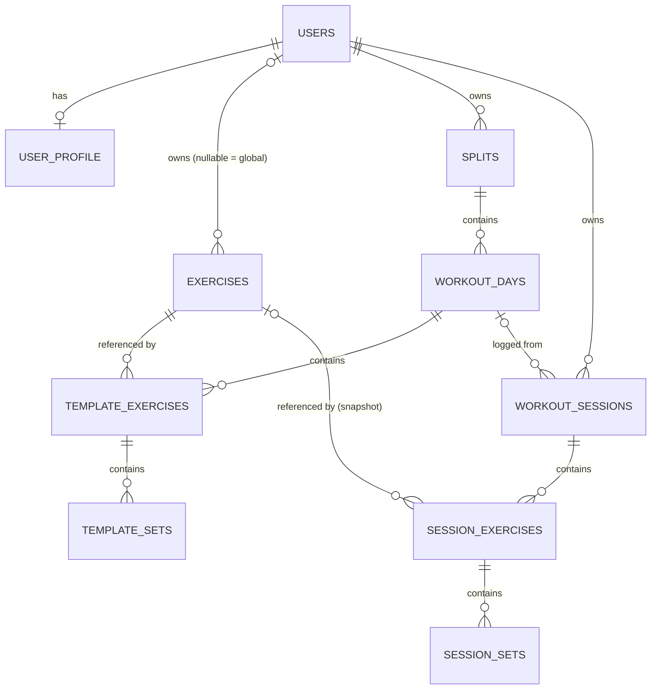

# IronTrail API

[](https://github.com/sagarjogadia28/iron-trail-api/actions/workflows/ci.yml)

A multi-user REST API for **IronTrail**, a workout tracking app built using Kotlin + Spring Boot, backed by PostgreSQL, containerized, and built with a real CI/CD pipeline.

It models the full training domain: a user builds reusable **splits** (workout routines organized into days, exercises, and target sets/reps), then logs real **workout sessions** against them, with history preserved independently of later edits to the plan.

## Tech Stack

| Layer | Choice |
|---|---|
| Language | Kotlin |
| Framework | Spring Boot |
| Database | PostgreSQL |
| ORM | Spring Data JPA + Hibernate |
| Migrations | Flyway |
| Auth | Spring Security + JWT (stateless) |
| Build | Gradle (Kotlin DSL) |
| Testing | JUnit 5, Mockito, Testcontainers |
| Containerization | Docker (multi-stage build) + Docker Compose |
| CI/CD | GitHub Actions → GitHub Container Registry |

## Architecture

Ownership is enforced at the database and service layer, not just the API surface: every resource is either directly owned (`owner_id` on the root of a tree) or transitively owned through its parent, and cross-user access is masked as `404`, not `403`, so a caller can never distinguish "doesn't exist" from "exists but isn't yours."



Two deliberate design choices worth calling out:

- **Snapshot fields on the history side.** A `WorkoutSession`/`SessionExercise` stores denormalized copies of the split/day/exercise name at the time it was logged (`splitNameSnapshot`, `exerciseNameSnapshot`, ...), with nullable `SET NULL` foreign keys back to the mutable planning entities. Editing or deleting a split later never rewrites or breaks past history.
- **PATCH, not PUT, for every update.** Real edits in this domain are single-field (rename a split, log one set) — every mutable resource has a parallel all-nullable `*PatchRequest` DTO, merged field-by-field, so a client only ever sends what actually changed.

## API Overview

Base path: `/api`. All endpoints except `/v1/auth/**` and `/v1/health` require `Authorization: Bearer <token>`.

**Auth**
| Method | Path | Description |
|---|---|---|
| POST | `/v1/auth/register` | Create an account, returns a JWT |
| POST | `/v1/auth/login` | Authenticate, returns a JWT |

**Profile & Home**
| Method | Path | Description |
|---|---|---|
| GET / POST / PATCH | `/v1/profile` | The caller's own profile (units, active split, notification prefs) |
| GET | `/v1/home` | Dashboard aggregate: next workout, month stats, streak, recent sessions |

**Exercises**
| Method | Path | Description |
|---|---|---|
| GET | `/v1/exercises?search=&muscleGroups=` | List, name search + multi-select muscle-group filter |
| POST | `/v1/exercises` | Create a custom exercise |
| GET / PATCH / DELETE | `/v1/exercises/{id}` | Get / update / delete a global or user-owned exercise |

**Splits (planning tree: Split → WorkoutDay → TemplateExercise → TemplateSet)**
| Method | Path | Description |
|---|---|---|
| GET / POST | `/v1/splits` | List / create |
| GET / PATCH / DELETE | `/v1/splits/{splitId}` | Full nested tree on GET |
| POST | `/v1/splits/{splitId}/duplicate` | Deep-copy a split |
| POST | `/v1/splits/{splitId}/workout-days` | Add a day |
| PATCH / DELETE | `/v1/workout-days/{workoutDayId}` | |
| POST | `/v1/workout-days/{workoutDayId}/duplicate` | Deep-copy a day within its split |
| POST | `/v1/workout-days/{workoutDayId}/template-exercises` | Add an exercise to a day |
| PATCH / DELETE | `/v1/template-exercises/{templateExerciseId}` | |
| POST | `/v1/template-exercises/{templateExerciseId}/template-sets` | Add a target set |
| PATCH / DELETE | `/v1/template-sets/{templateSetId}` | |

**Sessions (history tree: WorkoutSession → SessionExercise → SessionSet)**
| Method | Path | Description |
|---|---|---|
| GET | `/v1/workout-sessions?splitName=` | List, optional split-name filter |
| GET | `/v1/workout-sessions/active` | The caller's in-progress session, `204` if none |
| POST | `/v1/workout-sessions` | Start a new session |
| GET / PATCH / DELETE | `/v1/workout-sessions/{sessionId}` | State machine: `ACTIVE → PAUSED → COMPLETED` (terminal) |
| POST | `/v1/workout-sessions/{sessionId}/session-exercises` | Log an exercise into the session |
| PATCH / DELETE | `/v1/session-exercises/{sessionExerciseId}` | |
| GET | `/v1/session-exercises/{sessionExerciseId}/previous-performance` | Last logged sets for this exercise on this day |
| POST | `/v1/session-exercises/{sessionExerciseId}/session-sets` | Log a set |
| PATCH / DELETE | `/v1/session-sets/{sessionSetId}` | |

## Example

```bash
curl -X POST http://localhost:8080/api/v1/auth/register \
  -H "Content-Type: application/json" \
  -d '{"email": "test@example.com", "password": "password123"}'
```
```json
{
  "accessToken": "eyJhbGciOiJIUzM4NCJ9...",
  "tokenType": "Bearer",
  "expiresIn": 2592000
}
```

```bash
curl -X POST http://localhost:8080/api/v1/splits \
  -H "Authorization: Bearer $TOKEN" \
  -H "Content-Type: application/json" \
  -d '{"name": "Push Pull Legs"}'
```
```json
{
  "splitId": 1,
  "name": "Push Pull Legs",
  "workoutDays": []
}
```

## Testing

405 tests across three layers, each testing what that layer actually needs to prove:

- **Service & ownership-resolver layer** — JUnit 5 + Mockito, asserting business rules (404-masking on cross-user access, merge-patch semantics, state-machine transitions), not just current behavior.
- **Repository layer** — `@DataJpaTest` against a **real Postgres via Testcontainers**, not an in-memory substitute — this project has hit genuine Postgres-specific bugs (JPQL `IS EMPTY`, null-parameter type inference) that an H2 stand-in would never surface.
- **Controller layer** — `MockMvcBuilders.standaloneSetup()` per controller against mocked services, plus a dedicated test for the JWT filter itself.

```bash
./gradlew test
```

## Running Locally

```bash
docker compose up --build
```

Brings up Postgres (with a health check) and the API together; `GET /api/v1/health` should return `200 UP` on `http://localhost:8080`.

## Running the Published Image

Every push to `main` builds and publishes an image to GitHub Container Registry:

```bash
docker pull ghcr.io/sagarjogadia28/iron-trail-api:latest
```

Run it against a Postgres instance of your own via the same `DB_HOST`/`DB_USERNAME`/`DB_PASSWORD`/`JWT_SECRET` environment variables used in `docker-compose.yaml`.

## CI/CD

Every push and PR runs [`ci.yml`](.github/workflows/ci.yml): ktlint → full test suite → Docker build. The test step relies on two independent Postgres setups: the Testcontainers-backed repository tests provision their own disposable container per test run, while a GitHub Actions `services:` Postgres container backs the full application-context boot test. Pushes to `main` additionally publish the image to GHCR, tagged both `latest` and with the triggering commit SHA for traceable, reproducible deploys.
